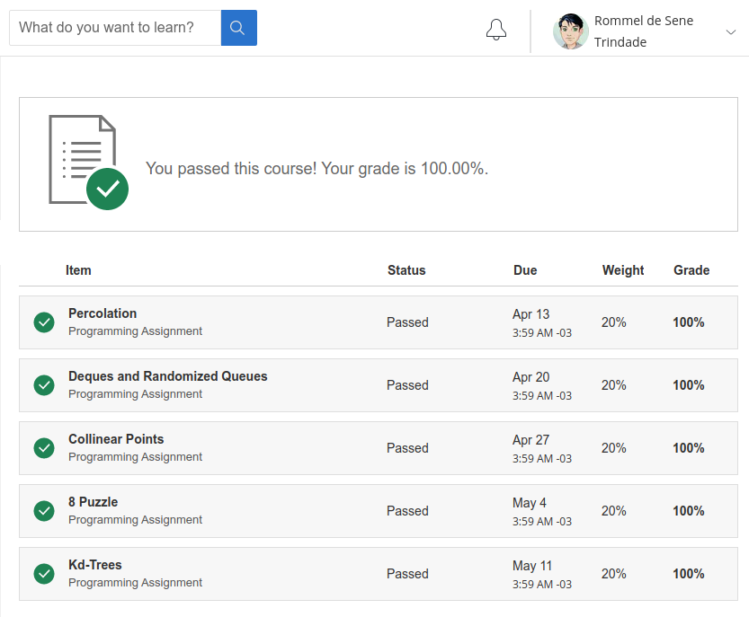

# Algorithms - Part I by Princeton University 
### Taugh by Robert Sedgewick & Kevin Wayne.
##### About this course.
>This course covers the essential information that every serious programmer needs to know about algorithms and data structures, with emphasis on applications and scientific performance analysis of Java implementations. **Part I** covers elementary data structures, sorting, and searching algorithms. **Part II** focuses on graph- and string-processing algorithms. All the features of this course are available for free. It does not offer a certificate upon completion.
[Visit the course](https://www.coursera.org/learn/algorithms-part1)

## Syllabus
| Week | Content | Assessment |
|--|--|--|
| [01](https://github.com/rommelst/algorithm-I/tree/master/java/Week01) | Course introduction -- Union-Find - Analysis of Algorithms | Percolation |
| [02](https://github.com/rommelst/algorithm-I/tree/master/java/Week02) | Stack and Queues -- Elementary Sorts| Deques and Randomized Queues |
| [03](https://github.com/rommelst/algorithm-I/tree/master/java/Week03) | Mergesort -- Quicksort | Collinear Points |
| [04](https://github.com/rommelst/algorithm-I/tree/master/java/Week04) | Priority Queues -- Elementary Symbol Tables | 8 Puzzle |
| [05](https://github.com/rommelst/algorithm-I/tree/master/java/Week05) | Balanced Search Trees -- Geometric Applications of BSTs | Kd-Trees |
| [06](https://github.com/rommelst/algorithm-I/tree/master/java/Week06) | Hash Tables -- Symbol Table Applications |  |

## Grade

:heavy_check_mark: :trophy:

# Instalation
### Downloading.
	git clone https://github.com/rommelst/algorithm-I.git

> **Intellij**: open the downloaded folder

> **Vscode**: open the java folder inside downloaded folder.

### Testing
There are many unit test in this project. Some of them was made meanwhile TDD approach was put into practice and other test cases was created according to the *Grader* during the weekly assessment

### C++ version
Coming as soon as possible.

