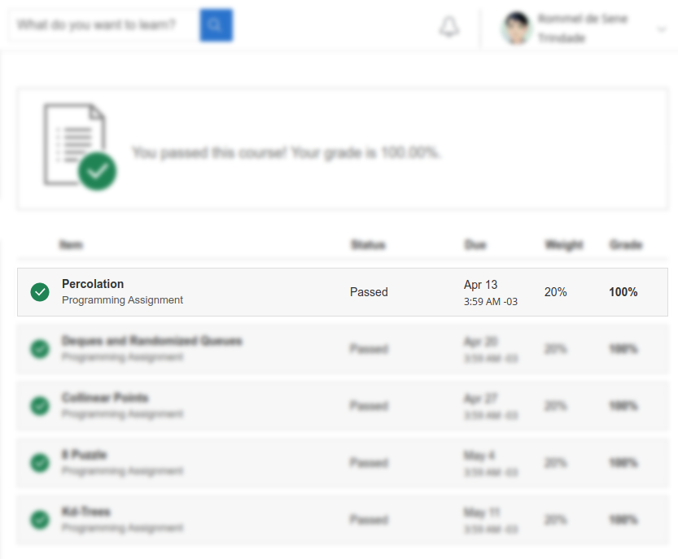
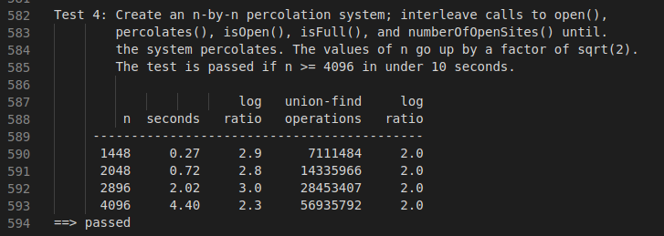
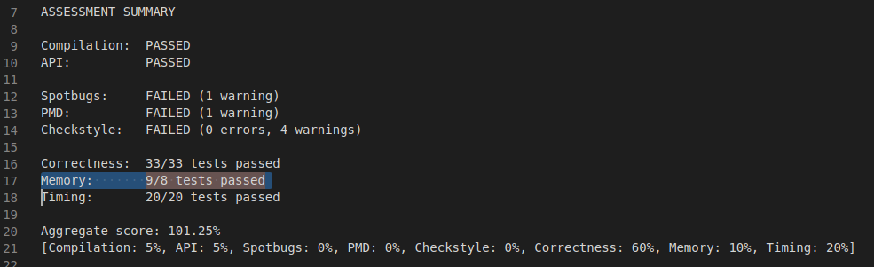
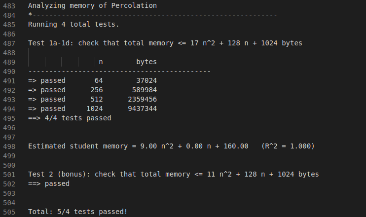

# Course introduction -- Union-Find - Analysis of Algorithms

##### About this week.
>**Union-Find**: we illustrate our basic approach to developing and analyzing algorithms by considering the dynamic connectivity problem. We introduce the union−find data type and consider several implementations (quick find, quick union, weighted quick union, and weighted quick union with path compression). Finally, we apply the union−find data type to the percolation problem from physical chemistry.

> **Analysis of Algorithms**: The basis of our approach for analyzing the performance of algorithms is the scientific method. We begin by performing computational experiments to measure the running times of our programs. We use these measurements to develop hypotheses about performance. Next, we create mathematical models to explain their behavior. Finally, we consider analyzing the memory usage of our Java programs.

##### Key Concepts
> - Apply the union-find data type to solve problems in science,
> engineering, and industry.
> - Define the union-find (or disjoint sets) data type.
> - Compare the performance of different algorithms for the union-find data type.
> - Design different algorithms (quick find, quick union, weighted quick union, path compression) - for the union-find data type.
> - Develop Java implementations of different algorithms for the union-find data type.
> - Use the parent-link representation to represent tree data structures.

## Programming Assignement

### Specification

> **Percolation.**  Given a composite systems comprised of randomly distributed insulating and metallic materials: what fraction of the materials need to be metallic so that the composite system is an electrical conductor? Given a porous landscape with water on the surface (or oil below), under what conditions will the water be able to drain through to the bottom (or the oil to gush through to the surface)? Scientists have defined an abstract process known as  *percolation*  to model such situations.

> **The model.**  We model a percolation system using an  *n-by-n*  grid of  *sites*. Each site is either  *open*  or  *blocked*. A *full*  site is an open site that can be connected to an open site in the top row via a chain of neighboring (left, right, up, down) open sites. We say the system  *percolates*  if there is a full site in the bottom row. In other words, a system percolates if we fill all open sites connected to the top row and that process fills some open site on the bottom row. (For the insulating/metallic materials example, the open sites correspond to metallic materials, so that a system that percolates has a metallic path from top to bottom, with full sites conducting. For the porous substance example, the open sites correspond to empty space through which water might flow, so that a system that percolates lets water fill open sites, flowing from top to bottom.)

See the specification here:
[https://coursera.cs.princeton.edu/algs4/assignments/percolation/specification.php](https://coursera.cs.princeton.edu/algs4/assignments/percolation/specification.php)

### Score

:heavy_check_mark: :trophy:

### Timing

Test04:

### Memory

Assessment summary.

Test1a-1d and Test2 (bonus)

##### Bônus for solving backwash problem without second Weighted Quick Union Find object.

>  **Backwash**: when percolation occurs, all components that contain an open cell in the bottom row are declared “full” (and will be visualized as such), because they are connected through the dummy bottom row to an actual full cell in the bottom row.

As shown by image Test2 (bonus), I solved the bachwashing problem by implmenting the percolation class without a second WeightedQuickUnionUF object. The algorithm used is described in *"COS 226 Bob’s Notes 1: Union-Find and Percolation (Version 2)*" file which can be accessed in the link bellow:
[COS 226 Bob’s Notes 1: Union-Find and Percolation (Version 2)](https://www.cs.princeton.edu/courses/archive/fall10/cos226/precepts/15UnionFind-Tarjan.pdf)