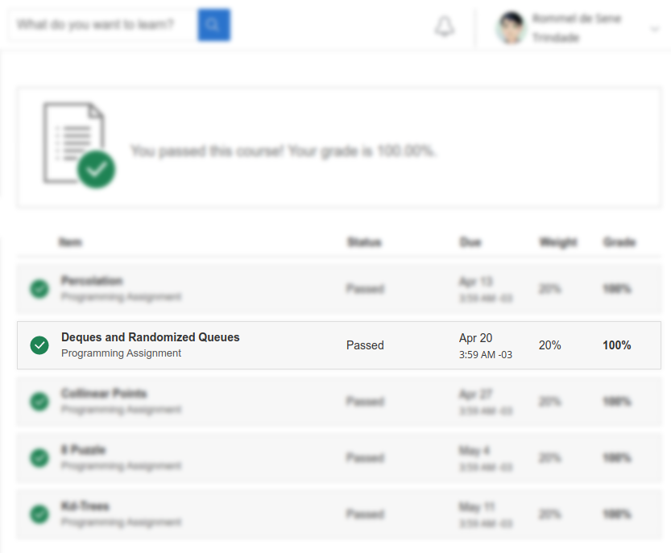
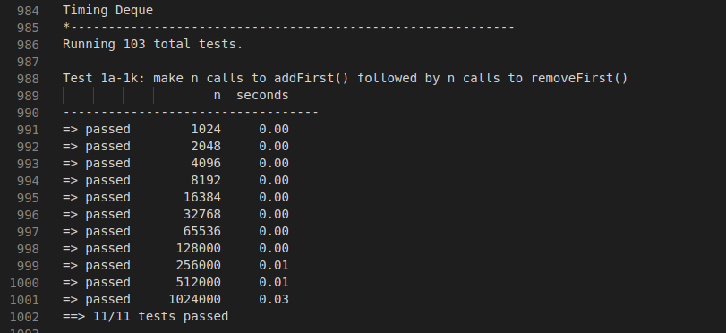
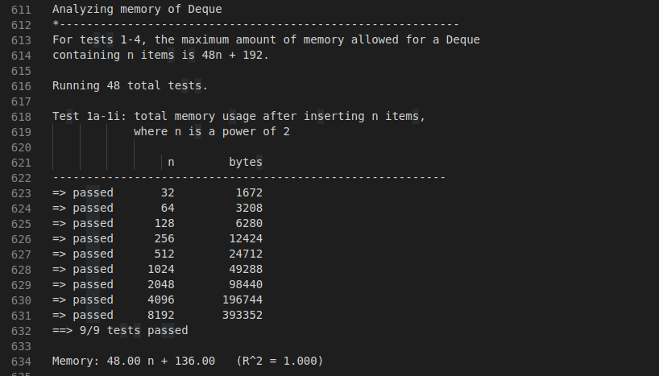

# Stack and Queues -- Elementary Sorts

##### About this week.
>**Stack and Queues**: We consider two fundamental data types for storing collections of objects: the stack and the queue. We implement each using either a singly-linked list or a resizing array. We introduce two advanced Java features—generics and iterators—that simplify client code. Finally, we consider various applications of stacks and queues ranging from parsing arithmetic expressions to simulating queueing systems.

> **Elementary Sorts**: We introduce the sorting problem and Java's Comparable interface. We study two elementary sorting methods (selection sort and insertion sort) and a variation of one of them (shellsort). We also consider two algorithms for uniformly shuffling an array. We conclude with an application of sorting to computing the convex hull via the Graham scan algorithm.

## Programming Assignement

### Specification

> **Dequeue.** A double-ended queue or deque (pronounced “deck”) is a generalization of a stack and a queue that supports adding and removing items from either the front or the back of the data structure. Create a generic data type Deque that implements a specific API.

> **Randomized queue.** A randomized queue is similar to a stack or queue, except that the item removed is chosen uniformly at random among items in the data structure. Create a generic data type RandomizedQueue that implements a specific API.

See the specification here:
[https://coursera.cs.princeton.edu/algs4/assignments/queues/specification.php](https://coursera.cs.princeton.edu/algs4/assignments/queues/specification.php)

### Score

:heavy_check_mark: :trophy:

### Timing

Test04:

### Memory

