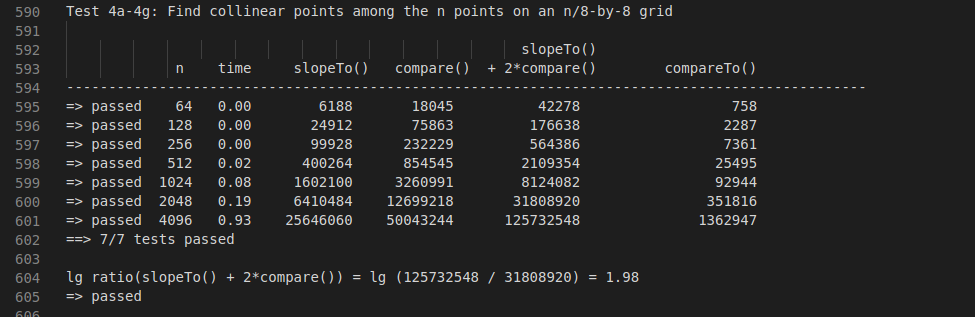
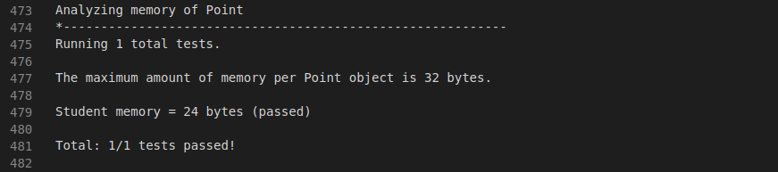

# Mergesort -- Quicksort

##### About this week.
>**Mergesort**: We study the mergesort algorithm and show that it guarantees to sort any array of n items with at most n lg n compares. We also consider a nonrecursive, bottom-up version. We prove that any compare-based sorting algorithm must make at least n lg n compares in the worst case. We discuss using different orderings for the objects that we are sorting and the related concept of stability.

> **Quicksort**: We introduce and implement the randomized quicksort algorithm and analyze its performance. We also consider randomized quickselect, a quicksort variant which finds the kth smallest item in linear time. Finally, we consider 3-way quicksort, a variant of quicksort that works especially well in the presence of duplicate keys.

## Programming Assignement - Collinear Points

> Write a program to recognize line patterns in a given set of points. Computer vision involves analyzing patterns in visual images and reconstructing the real-world objects that produced them. The process is often broken up into two phases: feature detection and pattern recognition. Feature detection involves selecting important features of the image; pattern recognition involves discovering patterns in the features. We will investigate a particularly clean pattern recognition problem involving points and line segments. This kind of pattern recognition arises in many other applications such as statistical data analysis.

>  **Fast Collinear Point.** Remarkably, it is possible to solve the problem much faster than the brute-force solution described above. Given a point p, the following method determines whether p participates in a set of 4 or more collinear points.
> - List item
> - Think of p as the origin.
> - For each other point q, determine the slope it makes with p.
> - Sort the points according to the slopes they makes with p.
> - Check if any 3 (or more) adjacent points in the sorted order have equal slopes with respect to p. If so, these points, together with p, are collinear.

See the specification here:
[https://coursera.cs.princeton.edu/algs4/assignments/collinear/specification.php](https://coursera.cs.princeton.edu/algs4/assignments/collinear/specification.php)

### Score

:heavy_check_mark: :trophy:

### Timing

Test04:

### Memory

